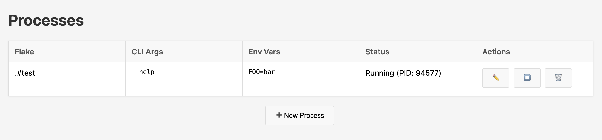
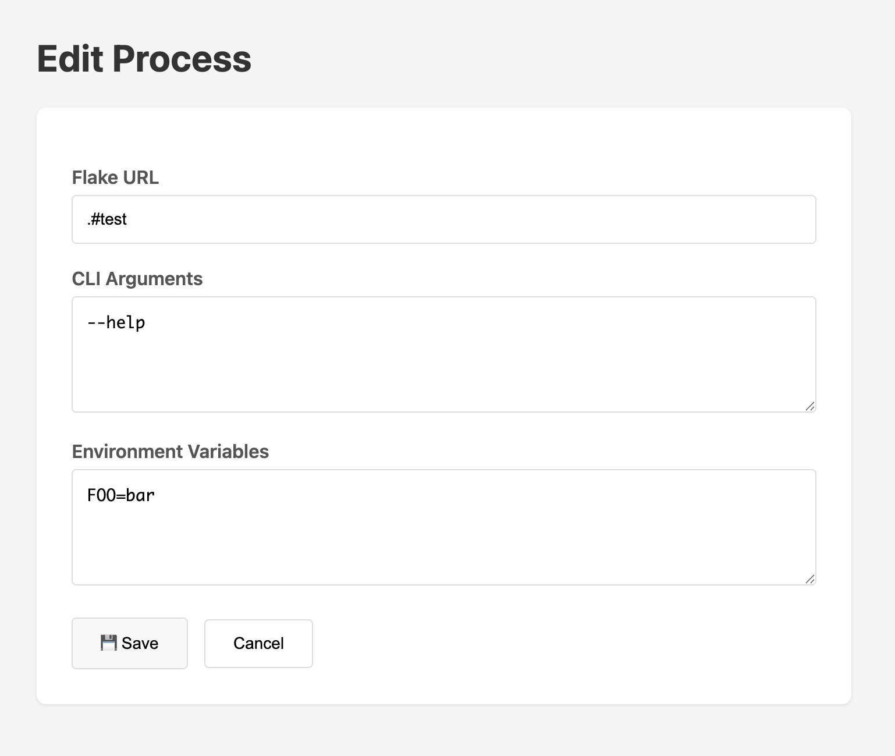

# minions (WIP)

A web-based process manager for running Nix flakes. Built in Zig to learn HTTP servers, C interop (SQLite), and process management.

## What it does

Manage long-running processes from Nix flakes through a simple web UI:

- Configure flake URLs, CLI args, and environment variables
- Start/stop/restart processes via `nix run`
- Track process state and PIDs

**Flakes-only, no exceptions.** If it doesn't work with `nix run github:user/repo#app`, it's out of scope.

## Usage

configure the IP address and port in `src/main.zig`

Build and run:

```bash
zig build run
```

View in your browser.

### Managing processes

**Main view:**



**Editing a process:**



Add your Nix flake URL, configure args/env vars, and click start. minions handles the rest.

## Why?

Learning goals:

- Zig HTTP server from scratch (`std.net`, `std.http`)
- C interop with vendored SQLite
- Process spawning and lifecycle management
- Deep Nix flakes integration
